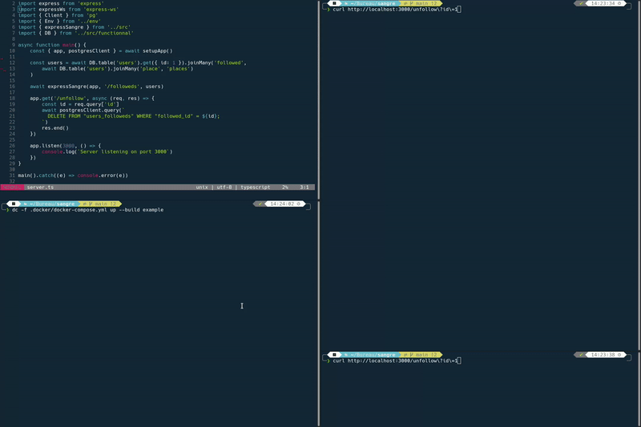

<div align="center">

<a href="https://github.com/pomarec/sangre">
  
</a>
<h2>Sangre</h2>
<br>

Sangre **streams your backend queries in realtime** to your clients minimizing the load via diffs.

Sangre lives with your current backend framework.

[Example](#example) •
[About The Project](#about-the-project) •
[How it works](#how-it-works) •
[Limitations](#limitations-poc) •
[Installation](#installation) •
[Contact](#contact) •
[Acknowledgments](#acknowledgments)


</div>

# Example

This example is based on typescript/javascript but feel free to imagine it in your own language (see [Limitations](#limitations-poc)).

It showcases a user that has a list of followed users. Each of those users have bookmarked places (restaurants, bars, etc.).

```typescript
async function main() {
  const { app, postgresClient } = await setupExpressApp() // create your express app

  // Create users node
  const users = await DB.table('users').get({ id: 1 }).joinMany('followed',
    await DB.table('users').joinMany('place')
  )

  // Plug the node to an endpoint
  app.sangre('/followeds', users);

  app.listen(8080)
}
```

This exposes a websocket endpoint streaming the user (id==1) with its followed users populated with their places.

The websocket streams the updates as this data changes in the database.

Below is a screencast of this example with a demonstration of its websocket output :

[](https://raw.githubusercontent.com/pomarec/sangre/main/doc/screencast.gif)

Another working example is showcased with a flutter client [here](example/).

# About The Project

Sangre provides a generic solution for streaming complex backend queries to clients in realtime.

A complex query is an arbitrary nested query of structured database data and processing of this data in your native backend language (js, python, etc.), only typescript/js is supported ATM.

The result of such query is streamed to client using incremental updates, minimizing network load, and enabling offline sync.

Typical use case is a client-server topology, a mobile or web app consuming an API (expressjs, django, rails, etc.) in front of a database (postgres, mongo, mysql, firebase, etc.). You want realtime data in your app without all the complexity of developing your own data sync.

Sangre implements all the following features and let the developers focus on business logic.

<div align="center">

| Features                                                                   |    |
| -------------------------------------------------------------------------- | -- |
| Realtime processing of relational database query + abitrary transformation | ✔️ |
| Client streaming over websocket                                            | ✔️ |
| Offline sync for clients                                                   | ✔️ |
| Minimal network load (incremental updates)                                 | ✔️ |
| Can be embedded into an existing project                                   | ✔️ |
| You need to adopt a new database                                           | ❌ |

</div>

# How it works 

Sangre is an acyclic graph of operator nodes acting on data. This data flows in those nodes as streams of data for reactivness.

Nodes may be filters, joins, populators. Root nodes provide data from the underling database (typically postgres) and listen to changes (via supabase realtime) in order to spread them down the data flow. Leaf nodes are the endpoints consumed by client apps (via websocket).

<div align="center">
  <h3>
    Sangre data flow
    
  </h3>
</div>

# Limitations (PoC)

At this point, Sangre is just a PoC. A lot of shortcuts have been taken to produce a working example. Here are known limitations, if you think about any other, please reach me out via [my contact info](#contact).

| Limits to overcome                                       | Feasibility |
| -------------------------------------------------------- | :---------: |
| Horizontal scalability                                   |     ✔️      |
| Observability                                            |     ✔️      |
| Upqueries                                                |     ✔️      |
| Language agnostic (needs implementation in each)         |     ❌      |
| Strict consistency                                       |     ❌      |
| Parametrized queries                                     |     ✔️      |
| Share nodes between similar queries                      |     ✔️      |

Diff algorithm is currently JSON patch. This can be easily changed for a more readable or effecient one (myers, histogram, yours ?)

# Installation

*Note : only postgres supported ATM (more to come)*

*Note : You can use .docker/docker-compose.yml to get a working example running*

## 1. Enable postgres replication

Run once on your postgres database :
```sql
ALTER SYSTEM SET wal_level = logical;
CREATE PUBLICATION supabase_realtime FOR ALL TABLES;
```

Reload your postgres configuration :
```
pg_ctl reload
```


## 2. Install realtime broker

Sangre uses [supabase/realtime](https://github.com/supabase/realtime/) to listen to database changes (insert/modify/delete of rows).

You can see details of its capabilities and installation process on their repo.

We give you an example of how to run it in docker compose :

```
  realtime:
    image: supabase/realtime
    environment:
      DB_HOST: <your_db_ip>
      DB_PASSWORD: <your_db_password>
      SECURE_CHANNELS: false
    ports:
      - 4000:4000
```

# Contact

[](mailto:po@marec.me)

Project Link: [https://github.com/pomarec/sangre](https://github.com/pomarec/sangre)


# Acknowledgments

- Inspirations :
  - [NoriaDB](https://github.com/mit-pdos/noria/) : Huge thanks to [Jon Gjengset](https://github.com/jonhoo) for clearing up my mind about this topic ([Whitepaper](https://www.usenix.org/conference/osdi18/presentation/gjengset)). Sangre is not an implementation of this paper though.
  - All the work done around materialized views and dataflows ([Raw list of sources](https://tartan-durian-108.notion.site/Pre-research-916a864988604fe2821d063321348a26))

- Supabase for their [realtime](https://github.com/supabase/realtime/) tool that transforms postgres replica "stream" to websocket events (easier to consume)

- Typescript / JS librairies in [package.json](package.json)

- Dart librairies in [pubspec](example/client/pubspec.yml)

- <a href="https://www.flaticon.com/free-icons/blood" title="blood icons">Blood icons created by Freepik - Flaticon</a>